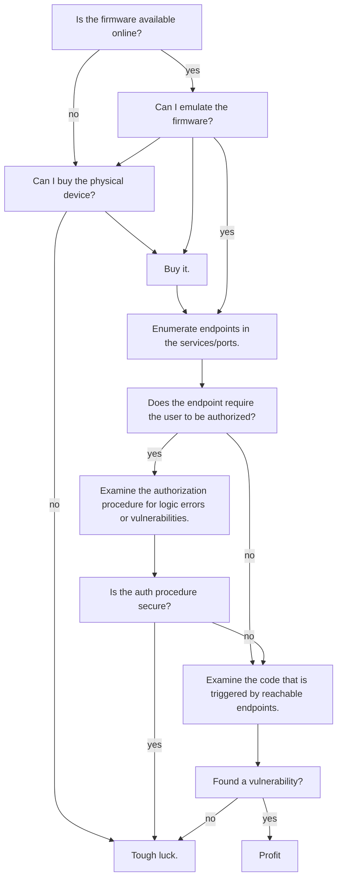

I've been [reading](/books) [Make It Stick](https://www.makeitstick.com/) after hearing about it in a [podcast](https://www.youtube.com/watch?v=YvWU4Zd-IMc) I heard on my run, and subsequently finding it on a bookshelf at my work's office.

The book is very metacognitive - it leads you through past studies and research to find the best ways to learn, and how to keep what you've learned remain learned. It's interesting.

I'm particularly interested because I've started a new job doing vulnerability research (VR). 

For the past couple years, I've been building software. It's been awhile since I got into the weeds of reverse engineering, assembly, Ghidra, and gdb.

It's hard, for multiple reasons:

- VR isn't straightforward.
  - It's not like building a python app or a website where there is more or less an agreed upon "right way" to do it. There's no "oh you should really use this library intead of that one" or "you adopt this method into your CI/CD". Every project is different. Every binary your reverse engineer works differently. Intuition and experience are therefore all the more necessary to getting good at finding bugs.
- World-class experts often don't share their knowledge.
  - In soccer, everyone knows who the world's best players are. Same with tennis. And basketball. We also know who the best movie directors and actors and song writers are. Of course we do - [experts become known for their excellence](https://youtu.be/jTdXqsrs4oI?t=31). But who are the best vulnerability researchers? Where are the intereviews and their books explaining their secret sauce? Frankly, many of these professionals are introverted computer hackers that spend much more time on their computers than talking to people. It's not sexy work, so there's no interviews. They don't like talking to people, so they don't put out a youtube video about their methods. And it's not worth writing a book, because the book will be out of date in five years.

So how do you get good at VR?

There aren't any shortcuts. You have to learn a lot, and learn to make it stick.

